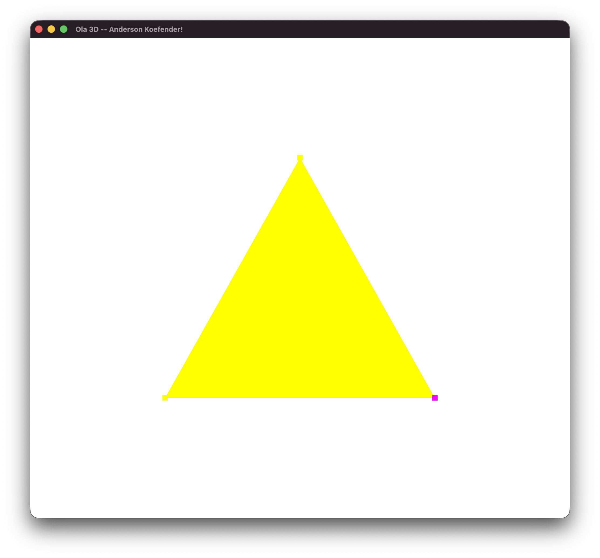
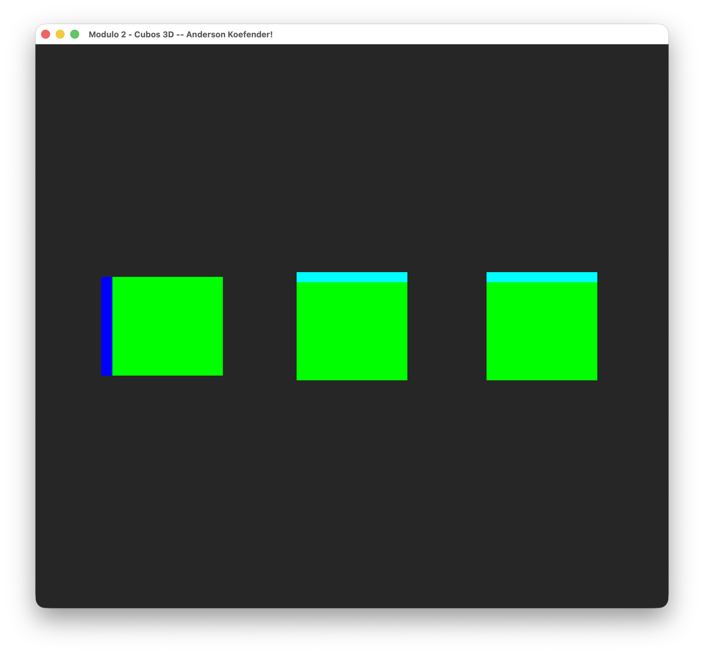

# Atividades de Computação Gráfica

Repositório com as entregas das atividades da disciplina de **Computação Gráfica** — Unisinos.

**Aluno:** Anderson Koefender  
**Linguagem:** C++  
**API Gráfica:** OpenGL 3.3+  (Feito no MacOS)

---

## Atividades

### ✅ Hello3D
Tarefa - Configuração do ambiente de desenvolvimento e execução do primeiro projeto OpenGL.

- Título da janela alterado para `Ola 3D -- Anderson Koefender!`
- Renderização de uma pirâmide 3D colorida com rotação nos eixos X, Y e Z

**Teclas:**
- `X` — rotaciona no eixo X
- `Y` — rotaciona no eixo Y
- `Z` — rotaciona no eixo Z
- `ESC` — fecha a janela

---

### ✅ M2
Tarefa - Instanciando objetos na cena 3D.

- Pirâmide substituída por um cubo com 6 faces, cada uma com uma cor diferente
- 3 cubos instanciados simultaneamente na cena, cada um com transformações independentes
- Controle de rotação, translação e escala uniforme via teclado

**Teclas:**
- `1` / `2` / `3` — seleciona o cubo ativo
- `X` — rotaciona no eixo X
- `Y` — rotaciona no eixo Y
- `Z` — rotaciona no eixo Z
- `W` / `S` — translada no eixo Z
- `A` / `D` — translada no eixo X
- `I` / `J` — translada no eixo Y
- `[` — diminui a escala uniformemente
- `]` — aumenta a escala uniformemente
- `ESC` — fecha a janela

