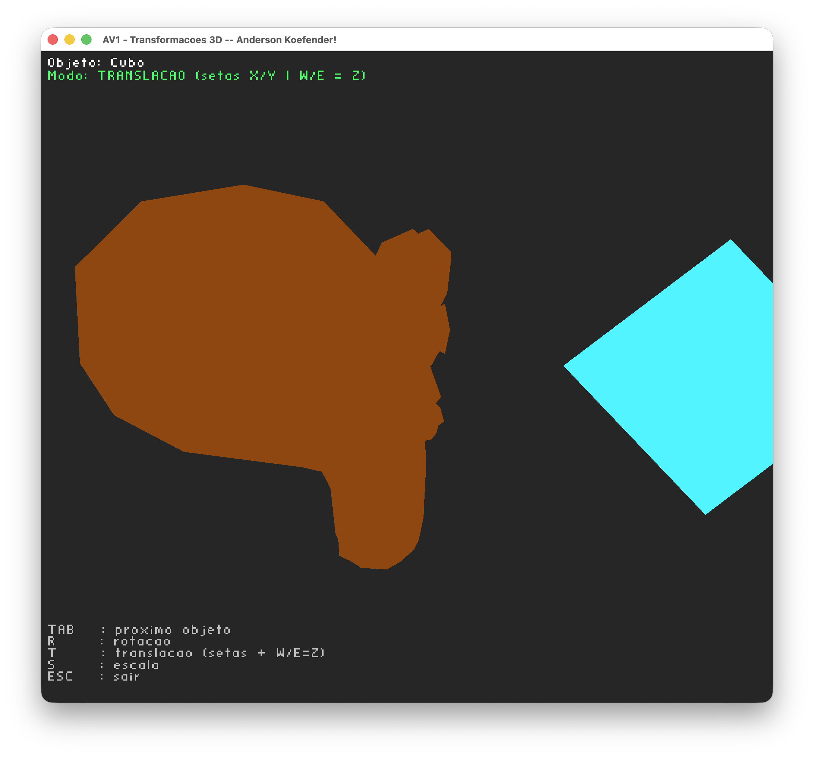
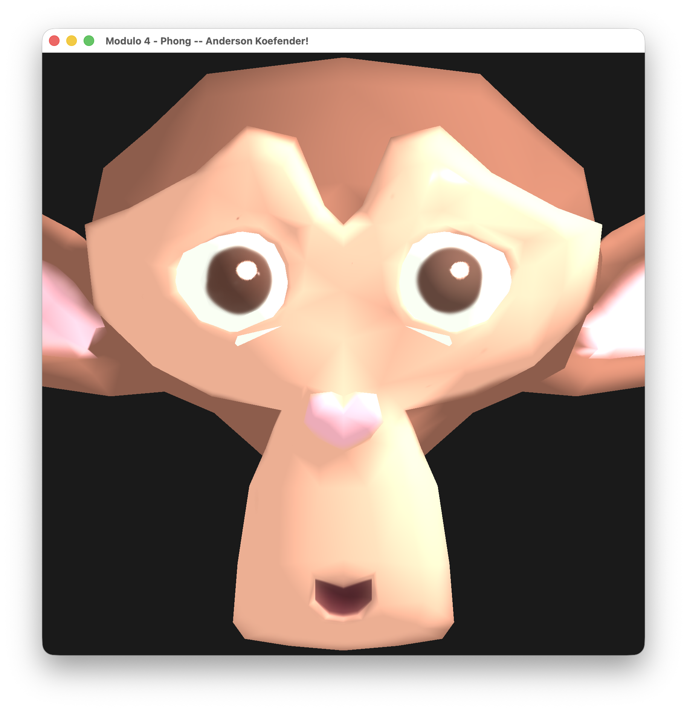
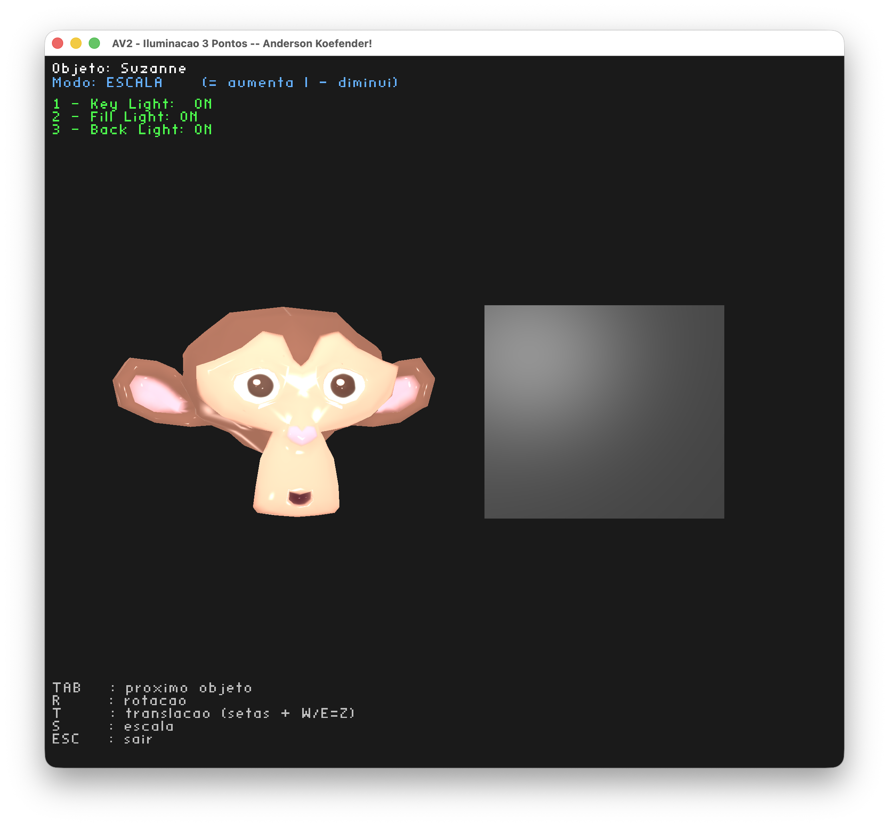

# Atividades de Computação Gráfica

Repositório com as entregas das atividades da disciplina de **Computação Gráfica** — Unisinos.

**Aluno:** Anderson Koefender  
**Linguagem:** C++  
**API Gráfica:** OpenGL 3.3+  (Feito no MacOS)

---

## Atividades

### ✅ Hello3D
Tarefa - Configuração do ambiente de desenvolvimento e execução do primeiro projeto OpenGL.

- Título da janela alterado para `Ola 3D -- Anderson Koefender!`
- Renderização de uma pirâmide 3D colorida com rotação nos eixos X, Y e Z

**Teclas:**
- `X` — rotaciona no eixo X
- `Y` — rotaciona no eixo Y
- `Z` — rotaciona no eixo Z
- `ESC` — fecha a janela

---

### ✅ M2
Tarefa - Instanciando objetos na cena 3D.

- Pirâmide substituída por um cubo com 6 faces, cada uma com uma cor diferente
- 3 cubos instanciados simultaneamente na cena, cada um com transformações independentes
- Controle de rotação, translação e escala uniforme via teclado

**Teclas:**
- `1` / `2` / `3` — seleciona o cubo ativo
- `X` — rotaciona no eixo X
- `Y` — rotaciona no eixo Y
- `Z` — rotaciona no eixo Z
- `W` / `S` — translada no eixo Z
- `A` / `D` — translada no eixo X
- `I` / `J` — translada no eixo Y
- `[` — diminui a escala uniformemente
- `]` — aumenta a escala uniformemente
- `ESC` — fecha a janela

---

### ✅ AV1
Vivencial 1 (09/05/26) - Selecionando e aplicando transformações em objetos 3D.

- Leitura de arquivos `.obj` e exibição de múltiplos modelos na cena
- Seleção de objetos via `TAB` (objeto selecionado aparece em destaque)
- Modos de transformação independentes por objeto: rotação, translação e escala

**Teclas:**
- `TAB` — seleciona o próximo objeto
- `R` — modo rotação → `X` / `Y` / `Z` escolhe o eixo
- `T` — modo translação → setas (X/Y) | `W` / `E` (Z)
- `S` — modo escala → `=` aumenta | `-` diminui
- `ESC` — fecha a janela

---

### ✅ M3
Tarefa - Texturização de objetos 3D.

- Leitura das coordenadas de textura (`vt`) do arquivo `.obj`
- Leitura do arquivo `.mtl` para obter o nome da textura difusa (`map_Kd`)
- Carregamento da imagem com stb_image e aplicação via `sampler2D` no fragment shader
- Múltiplos objetos com texturas independentes

**Teclas:**
- `TAB` — seleciona o próximo objeto
- `R` — modo rotação → `X` / `Y` / `Z` escolhe o eixo
- `T` — modo translação → setas (X/Y) | `W` / `E` (Z)
- `S` — modo escala → `=` aumenta | `-` diminui
- `ESC` — fecha a janela

---

### ✅ M4
Tarefa - Modelo de Iluminação de Phong.

- Leitura das normais (`vn`) do arquivo `.obj` como atributo de vértice
- Leitura dos coeficientes de material (`Ka`, `Kd`, `Ks`, `Ns`) do arquivo `.mtl`
- Cálculo das parcelas ambiente, difusa e especular no fragment shader (modelo de Phong)
- Textura como cor difusa do objeto

**Teclas:**
- `X` — rotaciona no eixo X
- `Y` — rotaciona no eixo Y
- `Z` — rotaciona no eixo Z
- `ESC` — fecha a janela

---

### ✅ AV2
Vivencial 2 (23/05/26) - Iluminação de três pontos.

- 3 luzes pontuais posicionadas automaticamente a partir do objeto principal da cena
- Luz principal (key), luz de preenchimento (fill) e luz de fundo (back) com intensidades calibradas
- Fator de atenuação quadrática aplicado à parcela difusa
- Coeficientes de material lidos do `.mtl` por objeto
- Liga/desliga cada luz individualmente via teclado

**Teclas:**
- `TAB` — seleciona o próximo objeto
- `R` — modo rotação → `X` / `Y` / `Z` escolhe o eixo
- `T` — modo translação → setas (X/Y) | `W` / `E` (Z)
- `S` — modo escala → `=` aumenta | `-` diminui
- `1` — liga/desliga a luz principal (key light)
- `2` — liga/desliga a luz de preenchimento (fill light)
- `3` — liga/desliga a luz de fundo (back light)
- `ESC` — fecha a janela

